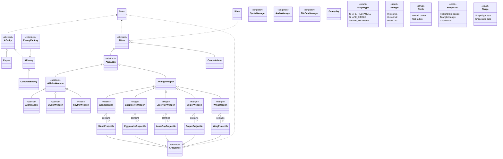

```mermaid
classDiagram

AEntity <|-- Player
AEntity <|-- AEnemy
AEnemy <|-- ConcreteEnemy
EnemyFactory ..> AEnemy
Stats <.. AEntity
Stats <.. AItem
Stats <.. AProjectile
AItem <|-- AWeapon
AItem <|-- ConcreteItem
AWeapon <|-- AMeleeWeapon
AWeapon <|-- ARangeWeapon
AMeleeWeapon <|-- AxeWeapon
AMeleeWeapon <|-- SwordWeapon
AMeleeWeapon <|-- ScytheWeapon
ARangeWeapon <|-- WandWeapon
ARangeWeapon <|-- EggplosiveWeapon
ARangeWeapon <|-- LaserRayWeapon
ARangeWeapon <|-- SniperWeapon
ARangeWeapon <|-- WingWeapon
Shop ..> AItem
WandProjectile --|> AProjectile
EggplosiveProjectile --|> AProjectile
LaserRayProjectile --|> AProjectile
SniperProjectile --|> AProjectile
WingProjectile --|> AProjectile
WandWeapon "1" o-- "0..*" WandProjectile : contains
EggplosiveWeapon "1" o-- "0..*" EggplosiveProjectile : contains
LaserRayWeapon "1" o-- "0..*" LaserRayProjectile : contains
SniperWeapon "1" o-- "0..*" SniperProjectile : contains
WingWeapon "1" o-- "0..*" WingProjectile : contains


class SpriteManager{
    <<singleton>>
}
class AudioManager{
    <<singleton>>
}
class FileDataManager{
    <<singleton>>
}
class Gameplay{

}
class  AEntity{
<<abstract>>
}
class Player{

}
class AEnemy{

}
class ConcreteEnemy{

}
class EnemyFactory{
    <<interface>>
}

class AItem{
    <<abstract>>
}
class ConcreteItem{

}
class AWeapon{
    <<abstract>>
}
class AMeleeWeapon{
    <<abstract>>
}
class ARangeWeapon{

}
class AxeWeapon{
    <<Warrior>>
}
class SwordWeapon{
    <<Warrior>>
}
class ScytheWeapon{
    <<Healer>>
}
class WandWeapon{
    <<Healer>>
}
class EggplosiveWeapon{
    <<Mage>>
}
class LaserRayWeapon{
    <<Mage>>
}
class SniperWeapon{
    <<Range>>
}
class WingWeapon{
    <<Range>>
}

class Shop{

}
class Stats{

}
class ShapeType{
    <<enum>>
    SHAPE_RECTANGLE
    SHAPE_CIRCLE
    SHAPE_TRIANGLE
}
class Triangle{
    <<struct>>
    Vector2 v1
    Vector2 v2
    Vector2 v3
}
class Circle{
    <<struct>>
    Vector2 center
    float radius
}
class ShapeData{
    <<union>>
    Rectangle rectangle
    Triangle triangle 
    Circle circle
}
class Shape{
    <<struct>>
    ShapeType type
    ShapeData data
}

class AProjectile{
    <<abstract>>
} 
class WandProjectile{

}
class EggplosiveProjectile{
    
}
class LaserRayProjectile{

}
class SniperProjectile{

}
class WingProjectile{

}
```